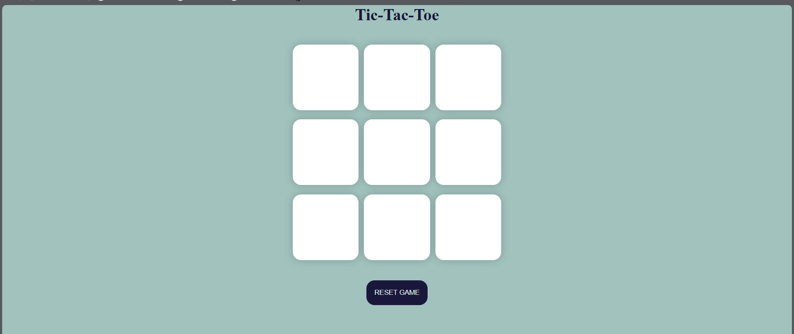
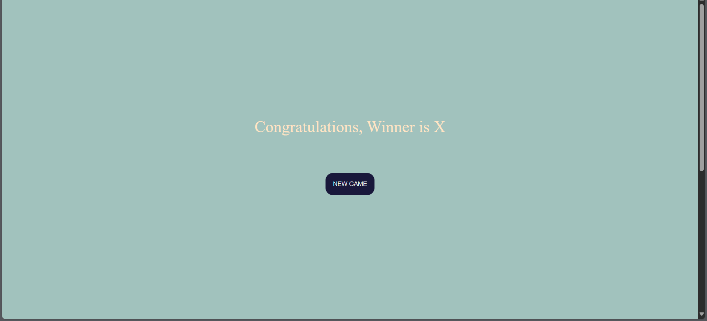

# 🎮 Tic Tac Toe Game

A simple **Tic Tac Toe** game built using **HTML, CSS, and JavaScript**.  
Play as **X** or **O** and see who wins – or if it ends in a draw!

---

## 🚀 Features
- Two-player game (X vs O)
- Detects winner based on standard Tic Tac Toe rules
- Declares a draw if all boxes are filled without a winner
- Reset and New Game options
- Simple, clean UI

---

## 📸 Screenshot


---

## 🛠️ Technologies Used
- **HTML5**
- **CSS3**
- **JavaScript (Vanilla JS)**

---

## ▶️ How to Play
1. Open `index.html` in your browser.
2. Player **O** starts first.
3. Click on the boxes to mark your move.
4. The game declares a **Winner** or **Draw** automatically.
5. Use the **Reset** or **New Game** button to play again.

---
## 🎮 Play Now
[Click here to play Tic Tac Toe](https://raveenakumari24.github.io/tictactoe/)

---
## 📂 Project Setup
Clone the repository and open it in your browser:

```bash
git clone https://github.com/your-username/tic-tac-toe.git
cd tic-tac-toe
